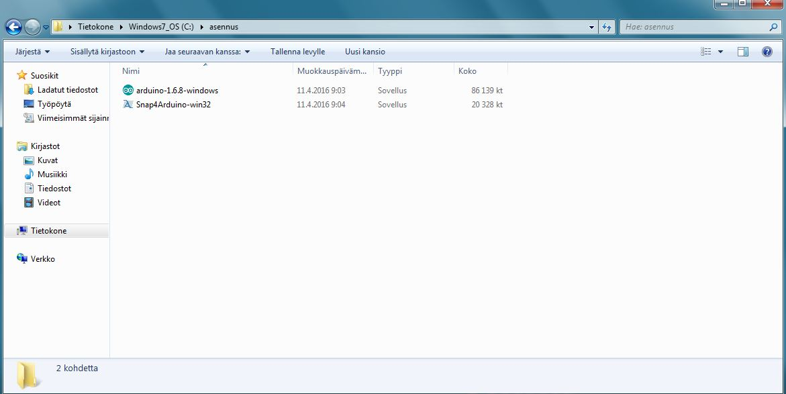
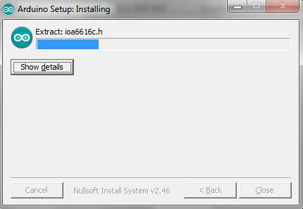

#Arduinon asennus

Käynnistämme asennusohjelman arduino-1.6.8-windows 

 

 
Lisenssisopimuksessa painamme "I agree"

  

 
Asetuksien pitäisi olla tämän näköisiä jonka jälkeen painamme "Next >"

  

 
Valitsemme minne asennetaan Arduino ja katsotaan mahtuuko tiedosto sijaintiin ja painetaan "Install"

  

 
Sitten vaan odotamme että Arduino asentuu jonka jälkeen voit painaa "Close"

