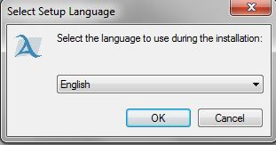
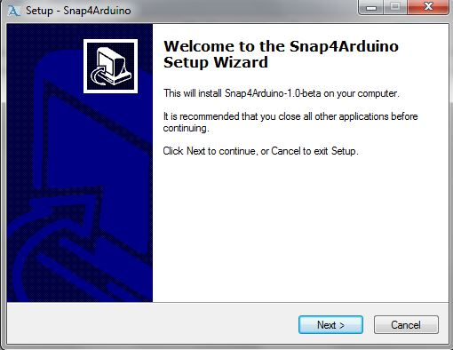
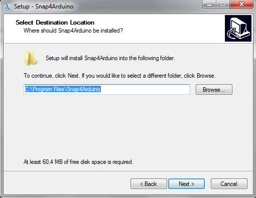
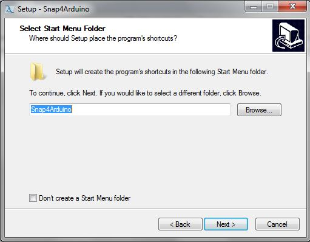
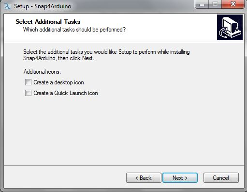
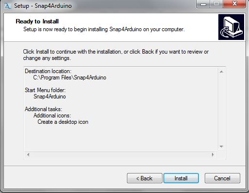
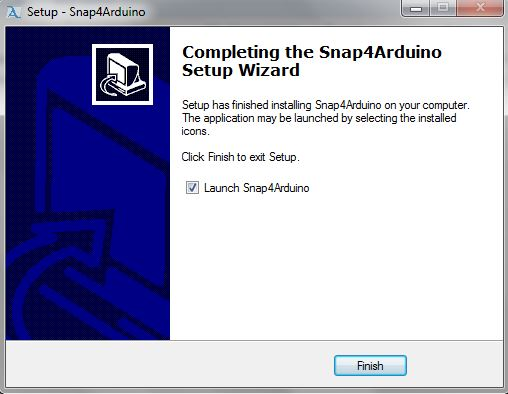

#Snap4Arduino asennus
 
**Huom! Asennathan ensin Arduinon ensin [Arduino ohje](Arduino_ohje.md)**
  
Snap4Arduinon asennusohjelman saat ladattua [täältä](https://github.com/opinsys/Snap4Arduino/releases/tag/v1.1)

Käynnistä Snap4Arduino-win32 asennusohjelma

  

 Valitse kieleksi englanti ja paina "Ok"    

 Paina "Next >"    

 Valitse polku minne asennat Snap4Arduinon ja paina "Next >"    

 Paina "Next >"    

 Paina "Next >"    

 Paina "Install"    

 Paina "Finish"
  

Sitten kun olet asentanut Arduinon ja Snap4Arduino joudut säätämään asetuksia hieman [Ohje](Arduino firmata.md)
