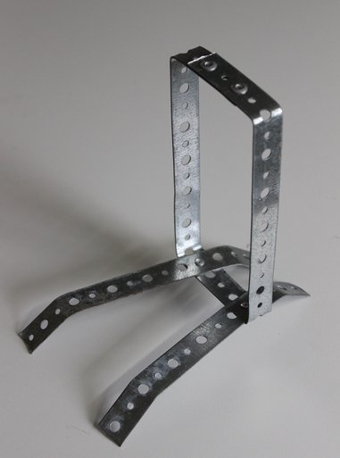

## Nallen rakennusohje

Aluksi tarvitaan nalle tai joku muu vastaava pehmolelu. Nallen tassut (etu/yläraajat) tulee olla helposti liikuteltavissa. 

Tavoitteena on saada muokattua nallea siten, että istuvan nallen tassuja voidaan liikuttaa. Lisäksi tarvittavat ohjauskomponentit halutaan sijoitaa nallen sisään, jolloin se voi toimia paristolla ilman ulkoista kaapelia.

Aluksi avataan nalle, tässä tapauksessa selässä olevasta ompelusaumaasta. Poistetaan täytettä, jotta voidaan sovittaa servoja kannattelevaa runkoa nallen sisään.

Runkomateriaalina käytetään reikävannetta. Reikävanteesta taitellaan nallen kokoon sopiva nelikulmio. Reikävanteen päät kiinnitetään toisiinsa popniiteillä. Rungon kokoa sovittaessa ota huomioon servojen koko, jotta ne mahtuvat olemaan nallen sisässä ja liikuttamaan tassuja.

Runkoon kiinnitetään vielä jalat, joiden avulla nalle saadaan pysymään halutussa asennossa.

Servot kiinnitetään rungon yläpäähän rautalangalla.

Tassun sisälle tulee rautalanka, jonka pitää olla riittävän vahvaa kannatellakseen tassua. Rautalanka kiinnitetään servon varteen kiinni ohuella rautalangalla.

Lopuksi valmis runko varusteineen asetetaan nallen sisään. Aiemmin poistetua täytettä lisätään sen verran, että nalle pysyy ryhdikkäässä asennossa.

Selässä olevaan aukkoon ommellaan vetoketju, jolloin komponettien vaihto onnistuu helposti.

