## Opinsys-nalle rakennusohje

Lisätietoja rakennussarjasta ja sen hankkimisesta: [http://www.opinsys.fi/nalle](http://www.opinsys.fi/nalle)

### Työkalut

Tarvitset sivuleikkurit, kärkipihdit ja pienen ruuvimeisselin.

### Valmistelevat toimenpiteet

Arduino kiinnitetään vanerilevyyn kolmen ruuvin avulla.

Koekytkentälevy kiinnitetään vanerin toiseen päähän tarran avulla.

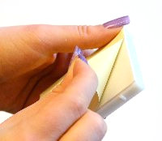

### Kytkentöjen tekeminen

**Kytkentäkaavio**

Kytketään jännite koekytkentälevyyn. Tämä saadaan aikaiseksi kytkemällä Arduinon 5V-ulostulo koekytkentälevyn punaisella merkittyyn + pinniin ja GND koekytkentälevyn – pinniin (musta). Lisäksi kytkentöjen helpottamiseksi koekytkentälevyn pystysuuntaiset + ja – linjat yhdistetään. Komponentit kytketään näiden väliin jääviin pinneihin, jotka jotka ovat yhteydessä toisiinsa päinvastaisessa suunnassa kuin + ja – pinnit.

#### Servot

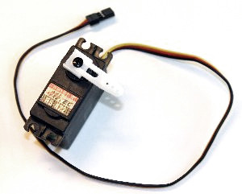

Servot tarvitsevat jännitteen lisäksi Arduinolta tulevan ohjauksen. Servojen liittimet eivät käy suoraan koekytkentälevyyn, joten kytkentää varten pitää asentaa piikkirimat (f-1,2,3 ja f-4,5,6).  + ja – saadaan kätevästi oikeasta laidasta lyhyillä hyppylangoilla (j-2, j-3, j-5, j-6). Lopuksi Arduinon pinneistä 2 ja 4 asennetaan johto servojen ohjausjohdon kohdalle (i-4 ja h-1). Servojen liittimet voidaan kytkeä molemmin päin, joten huomioi tämä tehdessäsi lopullista asennusta. Servon liittimessä punainen on +, musta on – ja keltainen on ohjaus.

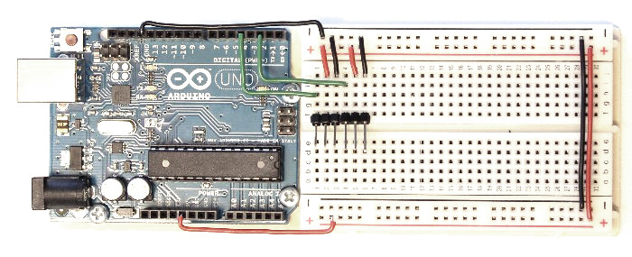

**Kytkennän testaus**

Kytke Arduino USB-kaapelilla tietokoneeseen ja lataa siihen ohjelma [Tassujen heilutus](/tassujen_heilutus/tassujen_heilutus.ino). Kun molemmat servot on kytketty oikein, niiden pitäisi pyörittää moottoria vuorotellen.

### Asentokytkin

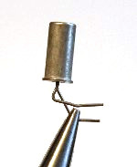

Taivuta asentosensorin jalat kuvan mukaisesti, jolloin koekytkentälevylle (h-14, i-13) asentaminen onnistuu helposti. Toiselle jaloista kytketään + (j-14). – kytketään toiseen jalkaan (j-13) vastuksen kautta. Asentokytkimen tila luetaan Arduinon pinnistä 8, joten tämä kytketään samaaan jalkaan kuin vastus (g-13).

**Kytkennän testaus**

Testaus suoritetaan kaiuttimen asennuksen jälkeen.

### Kaiutin

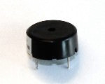

Kaiuttimen toiseen jalkaan kytketään ohjaus (g-22) Arduinon pinnistä 12 ja toiseen jalkaan – lyhyellä hyppylangalla (j-26).

**Kytkennän testaus**

Testataan asentokytkimen ja kaiuttimen toiminta yhtäaikaa. Lataa Arduinoon ohjelma [varoitus kaatumisesta](/varoitus_kaatumisesta/varoitus_kaatumisesta.ino). Kun kytkentä on normaalisti pöydällä pitäisi kuulua sireeniä muistuttava ääni. Kun nostat kytkentäkokonaisuuden ylös ja käännät sen siten, että asentokytkin on pystysuunnassa, niin sireenin ääni lakkaa.

### Valovastus

Valovastuksen jalkoihin kytketään jännite siten, että – tulee vastuksen kautta. Valovastuksen arvo luetaan Arduinon pinnistä A0 ja näin ollen se kytketään vastuksen puoleiseen jalkaan (c-14). Aluksi valovastus kannattaa kytkeä suoraan koekytkentälevyyn, mutta lopullisessa asennuksessa kytkentään käytetään erillisiä johtimia. Älä lyhennä tässä vaiheessa valovastuksen jalkoja, koska ne tarvitaan täyspitkinä lopullisessa asennuksessa.

**Kytkennän testaus**

Lataa Arduinoon ohjelma [ohikulkijalle vilkutus](/ohikulkijalle_vilkutus/ohikulkijalle_vilkutus.ino). Ensimmäisen viiden sekunnin aikana ohjelma kalibroi valovastuksen valitsevaan valon määrään. Kun tämän jälkeen peität valovastuksen siten, että siihen pääsee vähemmän valoa, toisen servon moottorin pitäisi liikkua. Kun lopetata valovastuksen peittämisen, moottorin pitäisi sammua.

### Komponenttien asennus nallen sisään

Nallen selässä on tarrakiinnitys, jonka avaamalla päästään nallen sisälle.

Ensimmäiseksi nallen sisälle täytyy tehdä tilaa komponenteille, joten täytettä otetaan reilusti pois. Ota täyte talteen, koska tarvitset sitä myöhemmässä vaiheessa.

#### Valovastus

Ensimmäisenä komponenttina kannattaa asentaa valovastus, koska myöhemmässä vaiheessa sen asentaminen on hankalaa. Hyvä paikka valovastukselle on nallen maha siten, että valovastuksen jalkojen väliin jää ompelesauma. Näin valovastuksen jalat eivät joudu helposti kosketuksiin nallen sisällä.

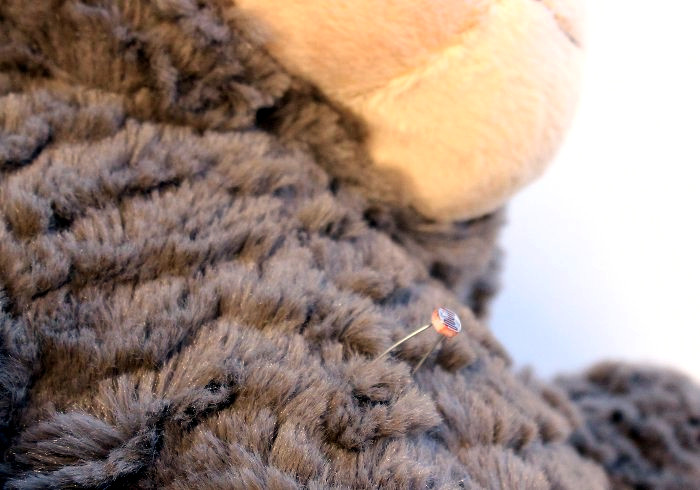

Valovastusten kytkemiseen rakennussarjassa on kaksi  n. 25cm mittaista naaras-uros kytkentäjohdinta. Valovastuksen jalat ovat liian ohuet kytkettäväksi suoraan ko. johtimeen, joten jalkoja on taivutettava esim. kärkipihdeillä. Tämän jälkeen kytkentäjohtojen naaraspuoli voidaan kytkeä valovastuksen jalkoihin.

#### Servot

Servojen lapoja on jatkettava, jotta niitä voidaan käyttää tassujen heiluttamiseen. Tähän käytetään rautalangan pätkiä (n. 15cm), jotka tulevat rakennussarjan mukana.

Taita aluksi rautalangan päätä, jotta tukeva kiinnitys on helpompi tehdä.

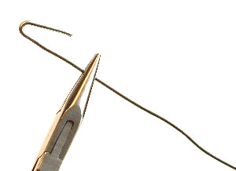

Ujuta rautalangan taivutettu pää servon lavan reiästä.

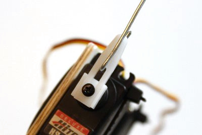

Tämän jälkeen kiinnitä sidoslangan avulla rautalanka tiukasti lapaan kiinni.

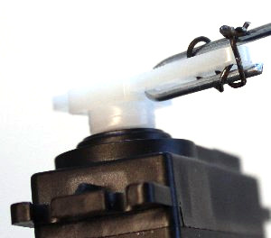

Lopuksi löysytä lavan ruuvia ja poista turhat välykset, jolloin rautalanka pysyy napakasti lavassa kiinni.

Servot asennetaan nallen sisään vanerilevyn avulla. Asenna nippusiteet valmiiksi vanerilevyn reikiin. Tämän jälkeen laita levy ilman servoja nallen sisään selässä olevan reiän kautta. Nippusiteiden kohdalle tulee servot, joten niiden pitää olla tassujen kohdalla.

Servot asennetaan nalleen sisään siten, että rautalangat ujutettan suoraan tassuihin. Asennus viimeistellään kiristämälle servon ympärille vanerilevyssä olevat nippusiteet. Muista tässä vaiheessa tarkistaa, että servojen liikerata vastaa tassujen liikerataa.

#### Arduino

USB-kaapeliin kannattaa tehdä nippusiteen avulla pieni lenkki, jolloin Arduinon asentaminen nallen sisään onnistuu helpommin ja USB-liittimeen ei kohdistu niin paljon rasitusta.

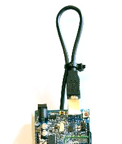

Kytkentäkokonaisuus (Arduino, koekytkentälevy, usb-kaapeli) kannattaa asentaa nalleen siten, että koekytkentälevy jää lähimmäksi selässä olevaa aukkoa. Näin johtojen kytkeminen onnistuu helpommin.

Lopuksi kiinnitetään vapaana olevat johdot kytkentään ja lisätään tarvittaessa täytettä niin, että nalle pysyy ryhdikkäästi pystyssä.

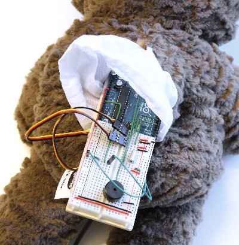

Suljetaan tarrakiinnitys ja nalle on valmis!

Hauskoja hetkiä ohjelmoinnin parissa!
